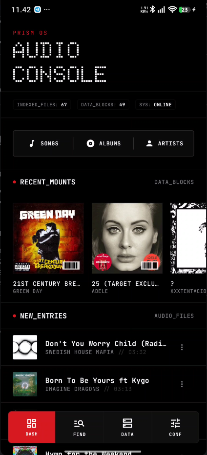
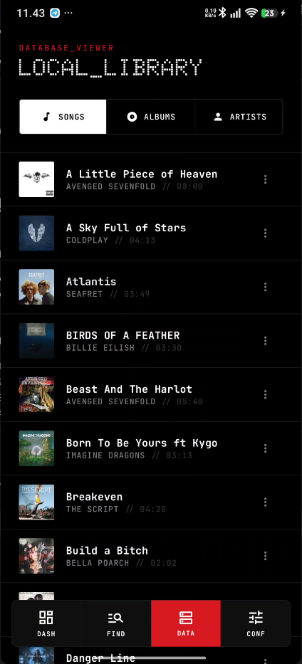
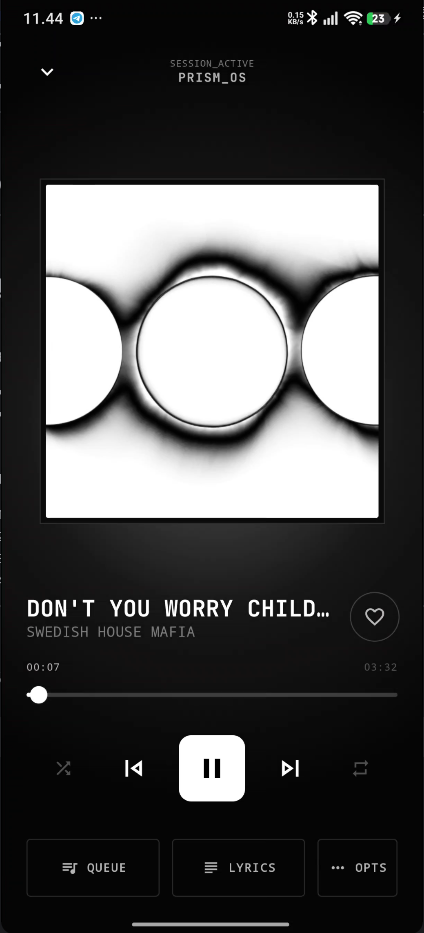
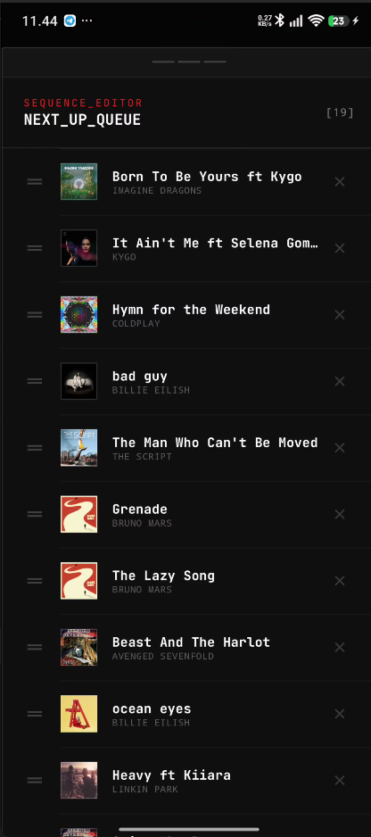
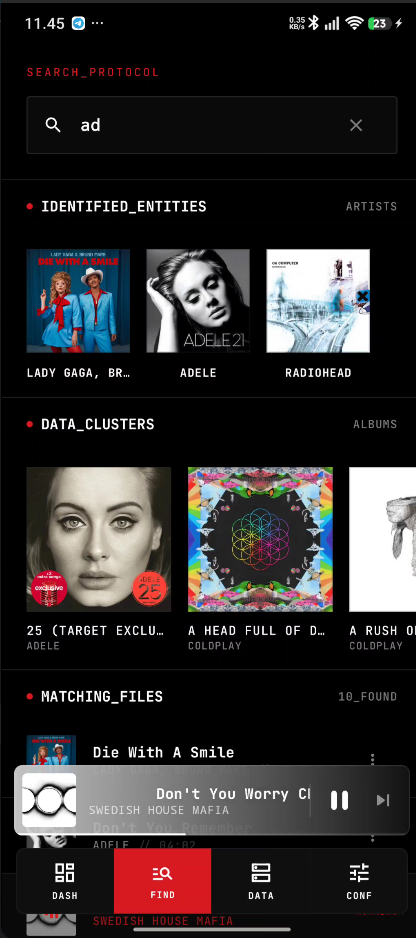
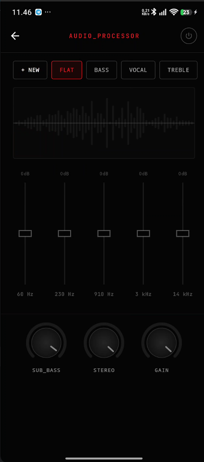

# PrismPlayer

**PrismPlayer** is a modern **offline Android music player** with a clean **Nothing OS** inspired UI, a powerful **metadata tagging system**, **queue**, **lyrics**, and a built‑in **equalizer**.

> **Play local audio, beautifully.** No account. No streaming. Just your music.

---

## What you get

* **Library** from your device audio (folder-based import + MediaStore)
*  Browse by **Songs / Albums / Artists**
* **Background playback** with notification controls (Media3)
* **Queue controls**: shuffle/repeat, clear, and **drag to reorder**
* **Equalizer**: presets + custom presets (device audio effects)
* **Edit metadata** (title, artist, album, genre, year, artwork) + refresh library
* **Lyrics**: fetch & cache from **LRCLIB** (plain + synced lyrics if available)

---

## Screenshot preview


<p align="center">
  
  
  
  
  
  
</p>

---

## Quick start

### Requirements

* **Android 7.0+ (API 24+)**
* Android Studio (recommended)

### Run from Android Studio

1. Clone / download this repo
2. Open the project in **Android Studio**
3. Wait for **Gradle sync**
4. Run on a device/emulator

---

## Build a release APK

The project includes a helper task that builds and copies a nicely named APK:

* **Gradle task:** `renameReleaseApk`
* Output (usually): `app/build/outputs/apk/release/PrismPlayer-<version>.apk`

You can run it from Android Studio’s **Gradle** panel or via terminal:

```bash
./gradlew renameReleaseApk
```

### Optional signing (for your own releases)

This project supports signing via Gradle properties:

* `KEYSTORE_PATH`
* `KEYSTORE_PASSWORD`
* `KEY_ALIAS`
* `KEY_PASSWORD`

Add them to your `~/.gradle/gradle.properties` (recommended) and build again.

---

## Permissions (why PrismPlayer asks)

* **READ_MEDIA_AUDIO / READ_EXTERNAL_STORAGE** → scan and play your local audio files
* **FOREGROUND_SERVICE(_MEDIA_PLAYBACK)** → keep music playing in background
* **POST_NOTIFICATIONS** → show playback controls in notifications
* **MODIFY_AUDIO_SETTINGS** → enable equalizer/audio effects

> Note: metadata editing may require write access depending on Android version and file location.

---

## Tech stack (short)

* **Kotlin**
* **Jetpack Compose + Material 3**
* **AndroidX Media3 (ExoPlayer + Session + UI)**
* **Room** (songs + play history + lyrics cache)
* **Retrofit + OkHttp** (lyrics from LRCLIB)
* **Coil** (artwork)
* **Reorderable** (drag-to-reorder queue)

---

## Project structure (for contributors)
* `ui/` → Compose screens, components
* `ui/player` → Player screen + view model
* `ui/player/managers` → manager files
* `ui/service/` → playback service (MediaSessionService)
* `data/` → Room database, DAOs, repositories
* `data/network/` → LRCLIB Retrofit client
* `data/source/` → local library + lyrics source

---

## Notes & limitations

* Audio format support depends on Android device decoders (common formats like MP3/AAC/FLAC usually work).
* Equalizer support varies by device (some phones provide limited bands or disable effects).
* Lyrics are fetched from LRCLIB **only when requested** and cached locally.

---

## Contributing

PRs and issues are welcome. When reporting a bug, please include:

* Android version + device model
* steps to reproduce
* screenshots/logs if possible

---

## Credits

* Lyrics provider: **LRCLIB** (`https://lrclib.net/`)

---

<p align="center">
  ⭐ If PrismPlayer is useful, consider starring the repo — it helps more people discover it!
</p>
